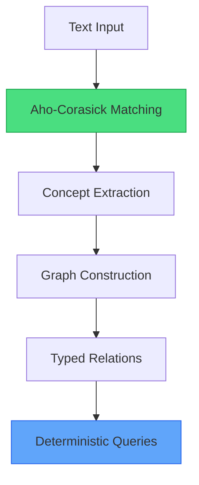
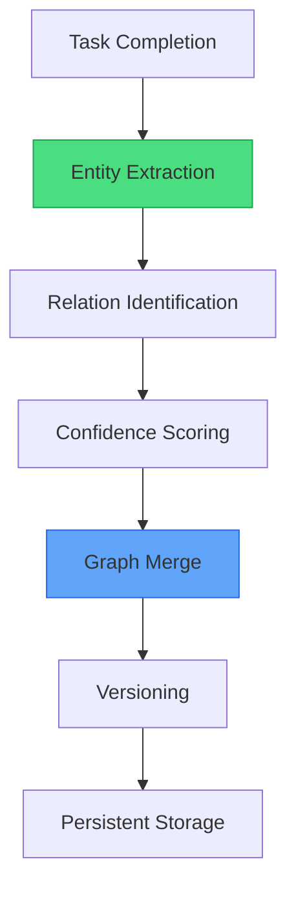

+++
title="The Knowledge Graph as Agent Memory"
date=2026-09-14

[taxonomies]
categories = ["Engineering", "Architecture", "AI Agents"]
tags = ["Terraphim", "knowledge-graph", "memory", "vector-rag", "production"]
[extra]
toc = true
comments = true
+++


*Why vectors aren't enough for production agent memory*

In March 2025, a customer support agent was asked to resolve a billing issue. The agent had access to a vector database containing 100,000 support tickets, FAQs, and documentation pages. The customer described their problem: "I was charged twice for my subscription last month, and the refund hasn't appeared yet."

The vector retriever returned:
1. A FAQ about subscription pricing (cosine similarity: 0.89)
2. A ticket about a user who forgot their password (cosine similarity: 0.87)
3. A documentation page about API rate limits (cosine similarity: 0.85)
4. A ticket about a duplicate charge from six months ago (cosine similarity: 0.82)

The correct answer — a specific refund policy that applies to duplicate charges within 30 days — was not in the top 10 results. It was in the vector database, but the query "charged twice" matched "subscription pricing" more closely than "duplicate charge refund policy" in embedding space.

The agent gave the customer the subscription pricing FAQ. The customer escalated to a human.

The problem was not the model. It was the memory architecture. Vector-based RAG is probabilistic, un-auditable, and prone to semantic drift. For production agents, memory must be deterministic, structured, and queryable.

This article explains why knowledge graphs beat vectors for agent memory, and how to build one that works.

---

## The Vector Memory Problem

Vector-based retrieval has three properties that make it unsuitable for production agent memory:

### 1. Probabilistic Retrieval

Given the same query, vector search may return different results. The reasons:
- Embedding model updates change vector positions
- Index rebuilds change approximate nearest neighbors
- Query preprocessing (stemming, stopword removal) changes query vectors
- Temperature and sampling in embedding models (if used)

This is fine for search engines. It is unacceptable for agents making decisions. An agent that gives different answers to the same question on different days is not reliable.

### 2. Un-auditable Results

When a vector retriever returns a document, the reason is: "cosine similarity: 0.87." This is not an explanation. It is a number.

You cannot audit why document A was chosen over document B. You cannot explain to a customer why the agent gave a particular answer. You cannot prove compliance with a regulation that requires explainable decisions.

### 3. No Structured Relations

Vector databases store documents as points in high-dimensional space. They do not store relations between documents. They cannot answer:
- "What other tickets did this customer open?"
- "Which refund policy applies to duplicate charges?"
- "What was the resolution of the last similar issue?"

These require graph traversal, not similarity search.

---

## The Debate: But Vectors Are Fast and Scalable

**The "Vectors Are Production-Ready" Argument:**

> "Vector databases like Pinecone, Weaviate, and Milvus are battle-tested at scale. They handle billions of documents with sub-100ms latency. Knowledge graphs are slow and don't scale."

This argument conflates two different things: the storage layer and the retrieval mechanism.

Vector databases are excellent storage layers. They are not excellent retrieval mechanisms for agents. The solution is not "don't use vectors." It is "don't use vectors for retrieval." Use a knowledge graph for retrieval, backed by whatever storage layer you prefer.

**The Counter-Counter-Argument:**

> "But knowledge graphs are hard to build and maintain. They require schema design, entity extraction, relation typing — it's a lot of work."

This is true for general-purpose knowledge graphs. It is not true for agent-specific knowledge graphs. An agent's memory graph does not need to model the entire world. It needs to model:
- The agent's tasks and their outcomes
- The documents the agent has seen and their relevance
- The patterns the agent has learned and their confidence
- The errors the agent has made and their corrections

This is a bounded, well-defined domain. The schema is not "everything." It is "what the agent needs to remember."

---

## The Solution: The Terraphim Knowledge Graph

The Terraphim knowledge graph is not a general-purpose graph database. It is a specialized structure optimized for one thing: fast, deterministic, explainable memory for agents.



### Core Design

```rust
// From terraphim_rolegraph — the knowledge graph
pub struct RoleGraph {
    pub role: RoleName,
    nodes: AHashMap<u64, Node>,
    edges: AHashMap<u64, Edge>,
    documents: AHashMap<String, IndexedDocument>,
    pub thesaurus: Thesaurus,
    pub ac: AhoCorasick, // Compiled automata
}

pub struct Node {
    pub id: u64,
    pub label: String,
    pub node_type: NodeType,
    pub properties: AHashMap<String, Value>,
}

pub struct Edge {
    pub id: u64,
    pub source: u64,
    pub target: u64,
    pub relation: RelationType,
    pub weight: f64,
}

#[derive(Debug, Clone, Serialize, Deserialize)]
pub enum RelationType {
    Implements,
    DependsOn,
    AuthoredBy,
    ReviewedBy,
    References,
    Supersedes,
    Corrects,
}
```

### Deterministic Matching

The key insight: retrieval is deterministic, not probabilistic.

```rust
impl RoleGraph {
    pub fn find_matching_node_ids(&self, text: &str) -> Vec<u64> {
        self.ac.find_iter(text)
            .map(|mat| self.aho_corasick_values[mat.pattern()])
            .collect()
    }
    
    pub fn query(&self, query: &GraphQuery) -> QueryResult {
        match query {
            GraphQuery::ExactMatch { term } => {
                // O(n) deterministic lookup
                self.find_matching_node_ids(term)
            }
            GraphQuery::Traversal { start, relation, depth } => {
                // Graph traversal with typed relations
                self.traverse(start, relation, depth)
            }
            GraphQuery::Path { from, to } => {
                // Shortest path with relation types
                self.shortest_path(from, to)
            }
        }
    }
}
```

**Why this works:**
- **Same query → same result.** Always. The automata matching is deterministic.
- **Explainable.** The result includes the matched pattern, the document source, and the relation path.
- **Fast.** O(n) where n is text length. No neural inference at retrieval time.
- **Small.** ~15 MB memory footprint. No GPU required.

### Typed Relations

The graph stores typed relations, not just similarity:

```
Customer "John Doe" --opened--> Ticket #1234
Ticket #1234 --describes--> "Duplicate charge"
"Duplicate charge" --resolved_by--> Policy "Refund within 30 days"
Policy "Refund within 30 days" --authored_by--> "Billing Team"
"Billing Team" --contactable_via--> "billing@company.com"
```

Query: "What policy applies to John Doe's duplicate charge?"

Traversal:
1. Find "John Doe" → get customer node
2. Follow `opened` edges → get Ticket #1234
3. Follow `describes` edge → get "Duplicate charge"
4. Follow `resolved_by` edge → get "Refund within 30 days"
5. Return policy with provenance

This is not "find similar documents." It is "follow the trail of evidence."

---

## Comparison: Vector RAG vs. Knowledge Graph

| Property | Vector RAG | Knowledge Graph |
|----------|-----------|-----------------|
| Retrieval | Probabilistic | Deterministic |
| Explainability | Cosine similarity score | Full provenance path |
| Relations | None (unstructured) | Typed (structured) |
| Query types | Similarity only | Exact match, traversal, path |
| Speed | O(n × d) neural | O(n) automata |
| Memory | ~2 GB GPU | ~15 MB RAM |
| Updates | Requires re-indexing | Incremental |
| Audit | Un-auditable | Fully auditable |

### When to Use Each

**Use Vector RAG when:**
- The task is semantic search ("find documents about X")
- Exact matching is not required
- Explainability is not critical
- The corpus is large and unstructured

**Use Knowledge Graphs when:**
- The task requires structured reasoning ("find the policy that applies")
- Determinism is required
- Audit trails are mandatory
- The domain is bounded and relational

**Use Hybrid when:**
- Initial retrieval is vector-based (broad recall)
- Re-ranking and reasoning is graph-based (precision and explainability)

---

## Building the Agent Memory Graph

The agent memory graph is built incrementally:



### 1. Entity Extraction

After each task, extract entities:
- Tasks: what was attempted
- Decisions: what was chosen
- Outcomes: what happened
- Errors: what went wrong
- Corrections: how it was fixed

### 2. Relation Identification

Link entities with typed relations:
- `Task --implemented_by--> Decision`
- `Decision --led_to--> Outcome`
- `Outcome --corrected_by--> Correction`
- `Error --superseded_by--> Fix`

### 3. Confidence Scoring

Memories are not treated as eternal truth:

```rust
pub struct Memory {
    pub entity: Entity,
    pub confidence: f64, // 0.0 - 1.0
    pub confirmations: usize,
    pub contradictions: usize,
    pub last_accessed: DateTime<Utc>,
}

impl Memory {
    pub fn update_confidence(&mut self, outcome: bool) {
        if outcome {
            self.confirmations += 1;
            self.confidence = self.confidence * 0.9 + 0.1;
        } else {
            self.contradictions += 1;
            self.confidence *= 0.8;
        }
        
        if self.confidence < 0.3 {
            self.archive();
        }
    }
}
```

### 4. Graph Merge

New memories are merged into the existing graph:
- Existing entity → update confidence
- New entity → add to graph
- New relation → add to graph
- Contradiction → mark both, reduce confidence

### 5. Versioning

The graph is versioned with Git:
- Every session produces a commit
- Rollbacks are `git checkout`
- Branches are parallel agent instances
- Merges are meta-cortex formation

---

## Measuring Memory Quality

Agent memory is measurable:

| Metric | Target | Measurement |
|--------|--------|-------------|
| Retrieval accuracy | >95% | Correct results / Total queries |
| Query latency | <10ms | Time to retrieve |
| Memory decay | <5%/month | Forgotten facts / Total facts |
| Confidence calibration | ±10% | Predicted vs. actual accuracy |
| Graph coverage | >90% | Queried entities / Total entities |

---

## Conclusion: Deterministic Memory for Deterministic Agents

Vector-based RAG is excellent for search. It is inadequate for agent memory. Agents need:
- **Deterministic retrieval** — Same query, same result
- **Structured relations** — Typed edges, not just similarity
- **Graph traversal** — Multi-hop reasoning, not just nearest neighbors
- **Versioning** — History of changes, not just current state
- **Explainability** — Provenance paths, not just scores

The knowledge graph is not a replacement for vectors. It is a complement. Use vectors for broad recall. Use graphs for precise reasoning. The combination — vector retrieval feeding into graph traversal — is the architecture that makes production agents reliable.

---

## Reference Implementation

The knowledge graph described in this article is implemented in Terraphim:

- **terraphim_rolegraph** — Typed knowledge graph with Aho-Corasick matching
- **terraphim_automata** — Deterministic concept extraction
- **terraphim_persistence** — Git-backed graph versioning
- **terraphim_types** — Entity and relation type system

Repository: [github.com/terraphim-ai/terraphim](https://github.com/terraphim-ai/terraphim)  
Documentation: [docs.terraphim.ai](https://docs.terraphim.ai)  
License: Apache-2.0

---

*Alexander Mikhalev is CTO & Head of AI at Zestic AI, where he architects AI-native platforms with deterministic safety guarantees. He is the creator of Terraphim, an open-source privacy-first AI assistant built in Rust.*
