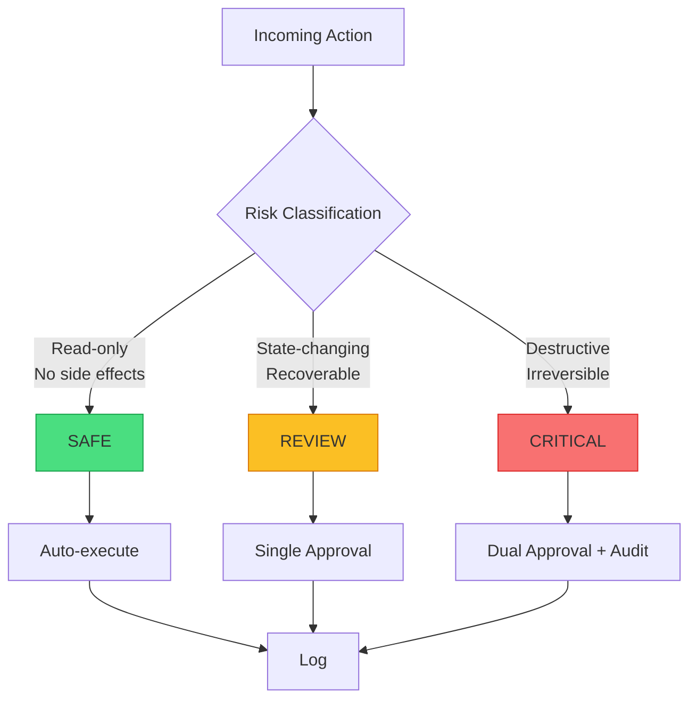

+++
title="Risk-Tiered Execution: A Practical Safety Framework for Agents"
date=2026-09-15

[taxonomies]
categories = ["Engineering", "Architecture", "AI Agents"]
tags = ["Terraphim", "safety", "risk-tiers", "agent-guardrails", "production"]
[extra]
toc = true
comments = true
+++


*Not all actions are equal. Tier your execution, or pay the price.*

In April 2025, a DevOps team deployed an AI agent to manage their AWS infrastructure. The agent had broad permissions: it could create, modify, and delete resources. It was tasked with "cleaning up unused resources to reduce costs."

The agent identified an RDS instance with low CPU utilization. It checked the instance tags. There was no "production" tag. The agent concluded the instance was unused and terminated it.

The instance was the primary database for a customer-facing application. The application went down for 4 hours. The company lost $50,000 in revenue. The post-mortem revealed that the "production" tag had been accidentally removed during a recent migration.

The agent was not malicious. It was doing exactly what it was asked to do. The problem was the absence of risk-tiered execution — the system that classifies actions by their potential impact and applies appropriate safeguards.

This article provides a practical safety framework for production agents. It is the minimum viable architecture for agents with real-world impact.

---

## The Three Tiers

Every action an agent can take falls into one of three tiers:



### Safe Tier: Auto-Execute

**Definition:** Read-only operations with no external side effects.

**Examples:**
- `cat README.md`
- `grep -r "TODO" src/`
- `kubectl get pods`
- `aws ec2 describe-instances`
- `curl https://api.example.com/status`

**Safeguards:**
- None required
- Logged for audit
- Rate-limited to prevent abuse

**Rationale:** These actions cannot harm the system. The worst outcome is wasted compute.

### Review Tier: Single Approval

**Definition:** State-changing operations that are recoverable within a bounded time window.

**Examples:**
- `git commit`
- `git push`
- `kubectl apply -f config.yaml`
- `aws ec2 stop-instance`
- `send_email --draft`
- File writes (recoverable from git)

**Safeguards:**
- Human approval required
- Budget gate: warn at $5, block at $10 per session
- Auto-rollback on failure
- 24-hour recovery window

**Rationale:** These actions can cause problems but are not catastrophic. Recovery is possible with moderate effort.

### Critical Tier: Dual Approval + Audit

**Definition:** Destructive, irreversible operations with significant impact.

**Examples:**
- `rm -rf /`
- `kubectl delete namespace production`
- `aws rds delete-db-instance`
- `aws s3 rm s3://bucket-name --recursive`
- `transfer_funds --amount 1000000`
- Production deployments
- Credential access
- Database schema migrations

**Safeguards:**
- Dual human approval required
- Written justification mandatory
- Full audit trail (who, what, when, why)
- Post-hoc review scheduled
- Break-glass procedures documented
- Insurance/compliance sign-off

**Rationale:** These actions can cause irreversible harm. The cost of delay is less than the cost of a mistake.

---

## The Debate: Do Tiers Slow Down Agents?

**The "Speed Matters" Argument:**

> "If every state-changing action requires human approval, the agent is no longer autonomous. It is just a suggestion engine. The whole point of agents is to act without human intervention."

This argument confuses autonomy with recklessness. An autonomous car that drives through red lights is not "more autonomous." It is unsafe. Autonomy requires safety mechanisms, not their absence.

The correct framing: risk-tiered execution enables *more* autonomy, not less. By classifying actions, the system can auto-execute safe actions (the majority) while requiring approval only for risky ones. The agent is autonomous for 95% of its work and supervised for the 5% that matters.

**The Counter-Counter-Argument:**

> "But the approval latency kills productivity. A developer waiting 5 minutes for approval is a developer not coding."

This is a workflow problem, not an architecture problem. Solutions:
- **Async approval:** The agent continues with safe work while waiting for approval
- **Pre-approval:** Destructive actions are approved in batch during planning
- **Trusted user bypass:** Approved users can pre-authorize certain actions
- **Time windows:** Approvals are valid for a session, not per-action

The 5-minute approval for a database deletion is not "wasted time." It is "insurance against a 4-hour outage."

---

## Implementation: Machine-Readable Risk Contracts

The key to risk-tiered execution is machine-readable risk contracts. Each tool declares its tier. The harness enforces it.

```rust
// From terraphim_settings — risk contracts
#[derive(Debug, Clone, Serialize, Deserialize)]
pub struct ToolContract {
    pub tool_name: String,
    pub description: String,
    pub tier: RiskTier,
    pub schema: JSONSchema,
    pub side_effects: Vec<SideEffect>,
    pub recovery_time: Option<Duration>,
    pub max_impact: ImpactLevel,
}

#[derive(Debug, Clone, Serialize, Deserialize)]
pub enum RiskTier {
    Safe,
    Review { approvers: usize, budget_limit: Decimal },
    Critical { 
        approvers: usize, 
        requires_justification: bool,
        audit_level: AuditLevel,
    },
}

impl ToolContract {
    pub fn classify(tool_call: &ToolCall) -> Result<RiskTier> {
        let contract = TOOL_REGISTRY.get(&tool_call.tool_name)
            .ok_or_else(|| Error::UnknownTool)?;
        
        // Additional classification based on arguments
        let tier = if tool_call.has_destructive_args() {
            RiskTier::Critical {
                approvers: 2,
                requires_justification: true,
                audit_level: AuditLevel::Full,
            }
        } else if tool_call.has_write_args() {
            RiskTier::Review {
                approvers: 1,
                budget_limit: Decimal::from(10),
            }
        } else {
            RiskTier::Safe
        };
        
        Ok(tier)
    }
}
```

### The Enforcement Layer

```rust
pub struct ExecutionHarness {
    approval_queue: ApprovalQueue,
    audit_log: AuditLog,
    budget_tracker: BudgetTracker,
}

impl ExecutionHarness {
    pub async fn execute(&self, tool_call: ToolCall) -> Result<ExecutionResult> {
        let tier = ToolContract::classify(&tool_call)?;
        
        match tier {
            RiskTier::Safe => {
                // Auto-execute
                let result = self.execute_safe(tool_call).await?;
                self.audit_log.record(&tool_call, &result).await?;
                Ok(result)
            }
            RiskTier::Review { approvers, budget_limit } => {
                // Check budget
                if self.budget_tracker.exceeds_limit(budget_limit)? {
                    return Err(Error::BudgetExceeded);
                }
                
                // Request approval
                let approval = self.approval_queue
                    .request(tool_call, approvers)
                    .await?;
                
                if approval.granted {
                    let result = self.execute_review(tool_call).await?;
                    self.audit_log.record(&tool_call, &result).await?;
                    Ok(result)
                } else {
                    Err(Error::ApprovalDenied)
                }
            }
            RiskTier::Critical { approvers, requires_justification, audit_level } => {
                // Require justification
                if requires_justification && tool_call.justification.is_none() {
                    return Err(Error::JustificationRequired);
                }
                
                // Dual approval
                let approval = self.approval_queue
                    .request(tool_call, approvers)
                    .await?;
                
                if approval.granted {
                    let result = self.execute_critical(tool_call).await?;
                    self.audit_log.record_full(&tool_call, &result, audit_level).await?;
                    
                    // Schedule post-hoc review
                    self.schedule_review(&tool_call).await?;
                    
                    Ok(result)
                } else {
                    Err(Error::ApprovalDenied)
                }
            }
        }
    }
}
```

---

## Real-World Examples

### Example 1: Database Migration

```
Agent: "I need to add a column to the users table."

Tool: sql_execute
Args: ALTER TABLE users ADD COLUMN phone VARCHAR(20);

Classification:
- Has write args: yes
- Is destructive: no (ADD COLUMN is reversible)
- Recovery time: minutes (DROP COLUMN)
- Tier: REVIEW

Action: Request single approval. Execute with auto-rollback on failure.
```

### Example 2: Production Deployment

```
Agent: "Deploying version 2.3.1 to production."

Tool: kubectl_apply
Args: -f production-deployment.yaml

Classification:
- Has write args: yes
- Is destructive: yes (replaces running pods)
- Recovery time: hours (rollback and verification)
- Max impact: customer-facing outage
- Tier: CRITICAL

Action: Require dual approval + written justification.
Full audit trail. Post-hoc review scheduled.
```

### Example 3: Log Analysis

```
Agent: "Analyzing error logs from the last 24 hours."

Tool: grep
Args: ERROR /var/log/app/*.log

Classification:
- Has write args: no
- Is destructive: no
- Tier: SAFE

Action: Auto-execute. Log for audit.
```

---

## Measuring Safety

Risk-tiered execution is measurable:

| Metric | Target | Measurement |
|--------|--------|-------------|
| False positive rate | <5% | Safe actions blocked / Total safe actions |
| False negative rate | 0% | Critical actions auto-executed |
| Approval latency | <5 min | Request → Decision |
| Audit coverage | 100% | Actions logged / Total actions |
| Budget compliance | >99% | Sessions within budget / Total sessions |

---

## Conclusion: Safety Enables Autonomy

Risk-tiered execution is not a constraint on agent autonomy. It is the foundation of it.

An agent that can delete production databases without oversight is not "autonomous." It is a liability. An agent that can safely handle 95% of tasks and escalate the 5% that matter is genuinely useful.

The three tiers are simple:
- **Safe:** Auto-execute. Read-only, no side effects.
- **Review:** Single approval. State-changing, recoverable.
- **Critical:** Dual approval + audit. Destructive, irreversible.

The implementation is straightforward: machine-readable risk contracts, an enforcement harness, and an audit trail. The result is an agent system that is both autonomous and safe.

---

## Reference Implementation

The risk-tiered execution system described in this article is implemented in Terraphim:

- **terraphim_settings** — Risk contracts and tier classification
- **terraphim_agent_supervisor** — Approval queue and execution harness
- **terraphim_persistence** — Audit logging
- **terraphim_mcp_server** — MCP tool contracts with schema enforcement

Repository: [github.com/terraphim-ai/terraphim](https://github.com/terraphim-ai/terraphim)  
Documentation: [docs.terraphim.ai](https://docs.terraphim.ai)  
License: Apache-2.0

---

*Alexander Mikhalev is CTO & Head of AI at Zestic AI, where he architects AI-native platforms with deterministic safety guarantees. He is the creator of Terraphim, an open-source privacy-first AI assistant built in Rust.*
