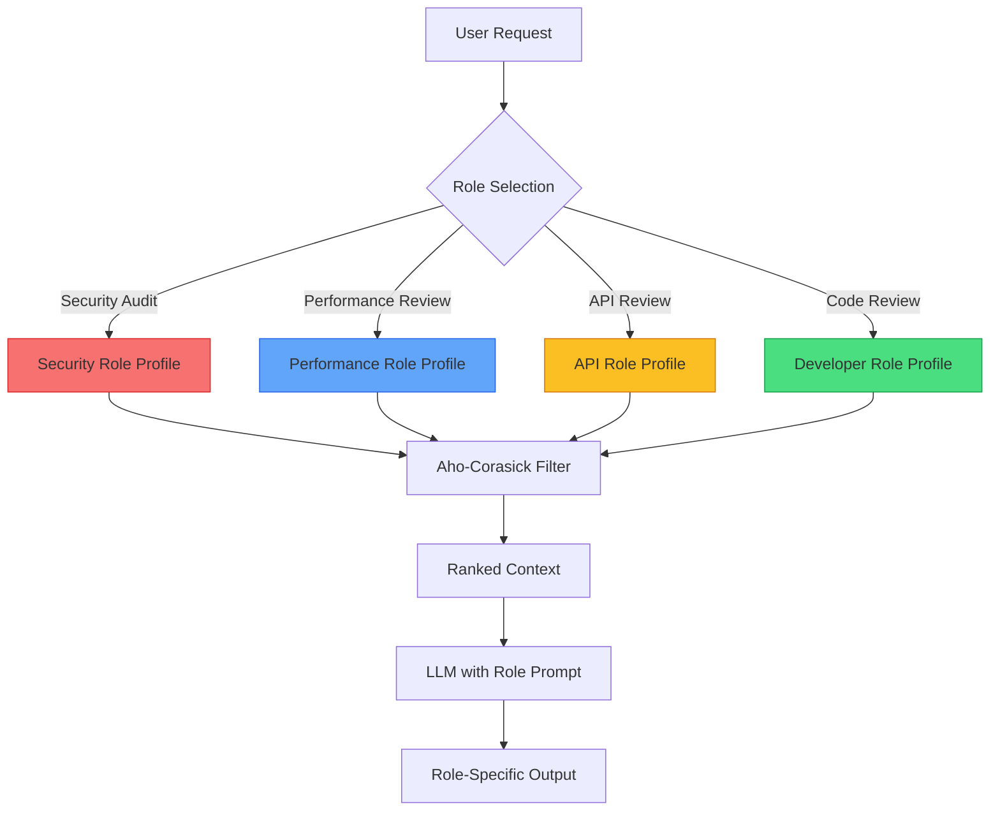
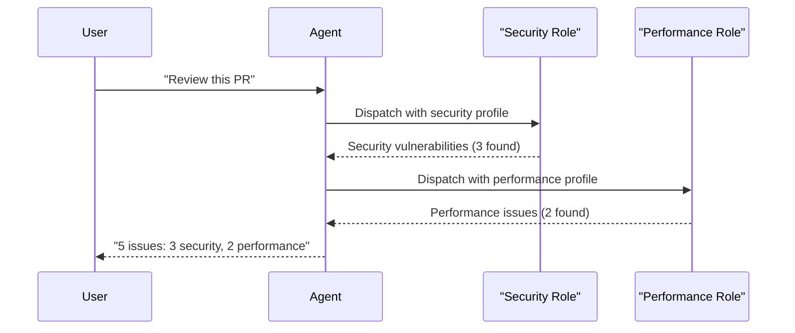

+++
title="Role-Based Context Dispatch: Why Your Agent Needs Multiple Personalities"
date=2026-09-13

[taxonomies]
categories = ["Engineering", "Architecture", "AI Agents"]
tags = ["Terraphim", "roles", "context-dispatch", "agent-architecture", "production"]
[extra]
toc = true
comments = true
+++


*The same input produces different outputs depending on who you ask. This is not a bug. It is a feature.*

In February 2025, a security team deployed an AI agent to audit their codebase for vulnerabilities. The agent was given full access to the repository — source code, configuration files, documentation, and deployment scripts. It reviewed 10,000 lines of code.

The agent found three "vulnerabilities":
1. A debug logging statement that printed a user ID (false positive — the log was local-only)
2. A SQL query built with string concatenation (false positive — it was a migration script, not production code)
3. A hardcoded API key in a test file (false positive — it was a mock key for unit tests)

Meanwhile, the agent missed a real vulnerability: an unvalidated redirect parameter in the authentication flow. The parameter was in a file the agent had read but did not flag because the agent was not in "security auditor" mode. It was in "general reviewer" mode.

The problem was not the model. It was the absence of role-based context dispatch — the system that decides what context to show based on what the agent is trying to accomplish.

This article explains why agents need multiple personalities, how role-based context dispatch works, and how to implement it without anthropomorphism.

---

## The Problem: One Agent, One Context

Current agent architectures treat the agent as a single entity with a single context window. The agent is "the coding agent" or "the review agent" or "the ops agent." It sees the same context regardless of the task.

This is efficient and wrong.

Consider a human team:
- A **security auditor** looks for vulnerabilities, injection points, and misconfigurations
- A **performance engineer** looks for bottlenecks, N+1 queries, and inefficient algorithms
- A **API reviewer** looks for backward compatibility, documentation completeness, and error handling
- A **junior developer** looks for code clarity, comments, and test coverage

The same codebase produces different reviews depending on who is looking at it. Not because the codebase changes, but because the reviewer brings a different lens.

Agents need the same capability. Not because we want them to "act like humans." Because different tasks require different context.

---

## The Debate: Is Role-Based Dispatch Just Prompt Engineering?

**The "It's Just a System Prompt" Argument:**

> "You can achieve the same thing with a system prompt. Just tell the model 'act like a security auditor' and it will focus on security issues."

This argument is partially true and dangerously incomplete.

A system prompt changes the model's *behavior* — how it responds, what it emphasizes, what tone it uses. It does not change the model's *context* — what documents it sees, what files it reads, what history it remembers.

The security auditor needs:
- OWASP guidelines
- Previous vulnerability reports
- Security-focused test cases
- Input validation patterns
- Authentication flow documentation

The performance engineer needs:
- Benchmark results
- Database query logs
- Memory usage profiles
- Previous optimization attempts
- Infrastructure configuration

The same codebase. Different context. A system prompt cannot provide context that is not in the window.

**The Counter-Counter-Argument:**

> "But you can include all context and let the model focus on what's relevant."

This is the "bigger window" fallacy, addressed in [Why 1M Token Windows Fail](https://reference-architecture.ai/posts/why-1m-token-windows-fail/). A window with all context is a window with all noise. The model's attention is a power law. It cannot effectively focus on security issues when 80% of the window contains irrelevant documents.

---

## The Solution: Role-Based Context Dispatch

The Terraphim approach makes roles first-class architectural entities, not just prompt decorations.



### Roles Are Configuration, Not Code

```rust
// From terraphim_config — Role definition
#[derive(Debug, Serialize, Deserialize, Clone)]
pub struct Role {
    pub name: RoleName,
    pub relevance_function: RelevanceFunction,
    pub haystacks: Vec<Haystack>,
    pub kg: Option<KnowledgeGraph>,
    pub llm_enabled: bool,
    pub llm_model: Option<String>,
    pub context_profile: ContextProfile,
}

#[derive(Debug, Serialize, Deserialize, Clone)]
pub struct ContextProfile {
    pub keywords: Vec<String>,
    pub document_types: Vec<String>,
    pub excluded_patterns: Vec<String>,
    pub recency_window: Duration,
    pub max_tokens: usize,
    pub compaction_strategy: CompactionStrategy,
}
```

A Role is not a prompt. It is a structured configuration that defines:
- **What the agent can access** (haystacks, knowledge graphs)
- **What the agent cares about** (keywords, document types)
- **What the agent ignores** (excluded patterns)
- **How the agent compacts context** (strategy, max tokens)

### The Context Boundary

The context boundary emerges naturally from the Role configuration:

```
Role: "security-auditor"
  Keywords: ["vulnerability", "injection", "XSS", "CSRF", "auth", "crypto"]
  Document types: [".rs", ".js", ".py", ".yaml", ".toml"]
  Excluded: ["test_", "bench_", "target/", "node_modules/"]
  Max tokens: 100,000
  Compaction: "security-focused"

Result: Only security-relevant documents enter the context window.
The agent cannot access performance benchmarks or API documentation
because they are not in the Role's haystacks.
```

This is not a runtime permission check that could be bypassed. It is an absence. The data was never loaded.

### Reference Implementation

```rust
// From terraphim_rolegraph — Role-based context dispatch
pub struct ContextDispatcher {
    roles: HashMap<RoleName, Role>,
    automata: HashMap<RoleName, AhoCorasick>,
}

impl ContextDispatcher {
    pub fn dispatch(&self, request: &Request, role_name: &RoleName) -> Context {
        let role = self.roles.get(role_name)
            .expect("Role not found");
        
        // 1. Filter documents by role profile
        let filtered = self.filter_by_role(&request.documents, role);
        
        // 2. Rank by relevance to role
        let ranked = self.rank_by_role(filtered, role);
        
        // 3. Compact using role-specific strategy
        let compacted = self.compact_by_role(ranked, role);
        
        // 4. Inject with role metadata
        Context::new(compacted)
            .with_role(role_name.clone())
            .with_profile(&role.context_profile)
    }
    
    fn filter_by_role(&self, documents: &[Document], role: &Role) -> Vec<Document> {
        let automata = self.automata.get(&role.name)
            .expect("Automata not compiled for role");
        
        documents.iter()
            .filter(|doc| {
                // O(n) deterministic matching
                automata.is_match(&doc.text) &&
                role.context_profile.document_types.iter()
                    .any(|t| doc.path.ends_with(t))
            })
            .cloned()
            .collect()
    }
}
```

---

## Case Study: The Critic Role

One of the most powerful roles in the Terraphim system is not a task role. It is a meta-role: the **critic**.

The critic role does not see the task context. It sees only the agent's own reasoning. This separation is deliberate:

```
Role: "critic"
  Keywords: ["assumption", "error", "bias", "fallacy", "unverified"]
  Document types: ["reasoning_trace", "plan", "decision_log"]
  Excluded: ["source_code", "test_output", "user_request"]
  Max tokens: 50,000
  Compaction: "reasoning-only"

Result: The critic reviews the agent's reasoning, not the task.
It catches logical errors, unverified assumptions, and cognitive biases
without being distracted by implementation details.
```

The critic role implements structured metacognition. It is the mechanism by which Terraphim agents review their own reasoning, catch their own errors, and improve their own performance. The +26% improvement on Terminal Bench came in part from the critic role catching planning errors before execution.

---

## Role Switching

Roles are not static. An agent can switch roles during a session:



Role switches are:
- **Explicit** — The agent declares which role it is using
- **Logged** — Every role switch is recorded for audit
- **Reversible** — The agent can switch back to a previous role
- **Composable** — Multiple roles can be combined for complex tasks

---

## Measuring Role Effectiveness

Role-based dispatch is measurable:

| Metric | Target | Measurement |
|--------|--------|-------------|
| Context relevance | >90% | Relevant docs / Total docs |
| False positive rate | <10% | Incorrect flags / Total flags |
| Miss rate | <5% | Missed issues / Total issues |
| Role switch efficiency | <50ms | Time to switch roles |
| Task completion delta | +20-30% | With vs. without roles |

---

## Conclusion: Roles Are Lenses

The role-based context dispatch system is not anthropomorphism. It is not "making agents act like humans." It is engineering: different tasks require different information, and the system that provides the right information to the right task at the right time is more effective than the system that provides all information to all tasks all the time.

A security auditor needs vulnerability reports, not benchmarks. A performance engineer needs profiles, not style guides. A junior developer needs clarity, not architecture documents.

The lens determines what you see. The role determines the lens.

---

## Reference Implementation

The role-based dispatch system described in this article is implemented in Terraphim:

- **terraphim_config** — Role definitions and context profiles
- **terraphim_rolegraph** — Role-scoped knowledge graphs
- **terraphim_automata** — Role-specific Aho-Corasick automata
- **terraphim_agent** — Interactive REPL with role switching

Repository: [github.com/terraphim-ai/terraphim](https://github.com/terraphim-ai/terraphim)  
Documentation: [docs.terraphim.ai](https://docs.terraphim.ai)  
License: Apache-2.0

---

*Alexander Mikhalev is CTO & Head of AI at Zestic AI, where he architects AI-native platforms with deterministic safety guarantees. He is the creator of Terraphim, an open-source privacy-first AI assistant built in Rust.*
