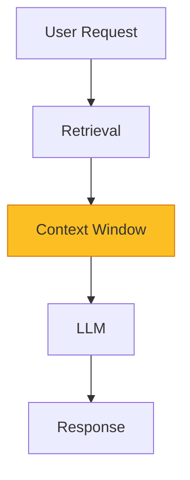
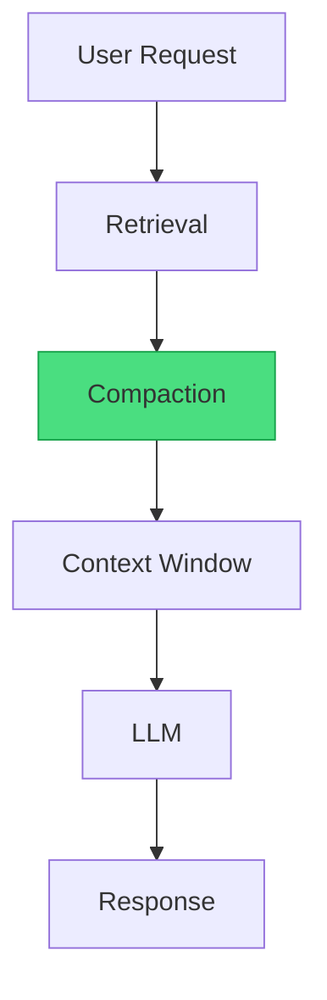

+++
title="Structured Compaction: The Missing Layer"
date=2026-09-12

[taxonomies]
categories = ["Engineering", "Architecture", "AI Agents"]
tags = ["Terraphim", "compaction", "context", "knowledge-graph", "production"]
[extra]
toc = true
comments = true
+++


*Curated signal beats raw capacity. Every time.*

In January 2025, a team at a fintech startup deployed an AI agent to review pull requests. The agent had access to a 200K token context window — the full PR diff, the codebase, the test suite, and the CI logs. The agent reviewed 50 PRs in a week.

The results were disappointing. The agent approved a PR that introduced a SQL injection vulnerability. It flagged a harmless refactor as "potentially breaking." It missed a race condition that had been present in the codebase for months.

The team increased the context window to 500K tokens. The results got worse. The agent approved more bad PRs and flagged more harmless ones. The signal-to-noise ratio had degraded.

The problem was not the model. It was not the context window size. It was the absence of a compaction layer — the pipeline that decides what to keep, what to discard, and what to summarize before the context reaches the model.

This article describes the structured compaction pipeline that transforms raw context into curated signal. It is the missing layer in most agent architectures.

---

## The Context Engineering Stack

Current agent architectures have three layers:



The retrieval layer fetches documents. The context window holds them. The LLM processes them. This is sufficient for simple tasks and insufficient for complex ones.

The missing layer is compaction:



Compaction sits between retrieval and the context window. It transforms retrieved documents into curated context. Without it, the context window becomes a dumping ground. With it, the context window becomes a briefing.

---

## The Five Stages of Compaction

### Stage 1: Ingest

**Input:** Raw documents, tool outputs, conversation history, system prompts.

**Process:** Normalize formats, extract text, preserve structure.

**Example:**
```
Input:  PDF spec (50 pages), GitHub issue (markdown), Slack thread (HTML)
Output: Structured documents with metadata (type, source, timestamp, author)
```

**Key principle:** Ingest everything. Judge nothing. The filtering happens in stage 2.

### Stage 2: Filter

**Input:** Normalized documents.

**Process:** Deterministic matching against role profiles.

**Mechanism:** Aho-Corasick automata.

```rust
// From terraphim_automata — deterministic filtering
pub struct DocumentFilter {
    automata: AhoCorasick,
    role_profile: RoleProfile,
}

impl DocumentFilter {
    pub fn filter(&self, documents: Vec<Document>) -> Vec<Document> {
        documents.into_iter()
            .filter(|doc| self.is_relevant(doc))
            .collect()
    }
    
    fn is_relevant(&self, doc: &Document) -> bool {
        // O(n) matching, where n is document length
        self.automata.is_match(&doc.text)
    }
}
```

**Why Aho-Corasick?**

| Property | Aho-Corasick | Vector Search | BM25 |
|----------|-------------|---------------|------|
| Speed | O(n) | O(n × d) | O(n log n) |
| Determinism | ✅ Yes | ❌ No | ✅ Yes |
| Explainability | ✅ Exact match | ❌ Similarity | ✅ Term frequency |
| GPU required | ❌ No | ✅ Yes | ❌ No |
| Memory footprint | ~15 MB | ~2 GB | ~100 MB |

Aho-Corasick is not "worse than vector search." It is different. It trades semantic flexibility for deterministic speed. For production agents, deterministic speed is the right tradeoff.

**The Debate: Does Deterministic Filtering Miss Important Content?**

**The "Semantic Matching Is Better" Argument:**

> "Aho-Corasick only matches exact keywords. It will miss documents about 'performance optimization' if the role profile only has 'speed.' Vector search catches semantic similarity."

This is true in the abstract and addressable in practice. The Terraphim approach uses a thesaurus:

```rust
pub struct Thesaurus {
    synonyms: HashMap<String, Vec<String>>,
}

impl Thesaurus {
    pub fn expand(&self, term: &str) -> Vec<String> {
        // "rust" → ["rust", "rustlang", "rust-lang"]
        // "performance" → ["performance", "speed", "optimization", "latency"]
        self.synonyms.get(term)
            .cloned()
            .unwrap_or_else(|| vec![term.to_string()])
    }
}
```

The thesaurus is role-specific and user-maintained. It captures domain-specific synonyms without the non-determinism of vector search.

### Stage 3: Rank

**Input:** Filtered documents.

**Process:** Graph-theoretic relevance scoring.

```rust
// From terraphim_rolegraph — PageRank scoring
pub fn rank_documents(&self, documents: Vec<Document>) -> Vec<ScoredDocument> {
    documents.into_iter()
        .map(|doc| {
            let score = self.graph_score(&doc);
            ScoredDocument { document: doc, score }
        })
        .sorted_by(|a, b| b.score.partial_cmp(&a.score).unwrap())
        .collect()
}

fn graph_score(&self, doc: &Document) -> f64 {
    let mut score = 0.0;
    
    // Frequency in successful outcomes
    score += self.success_frequency(doc.id) * 0.3;
    
    // Bridge score (connects multiple concepts)
    score += self.bridge_score(doc.id) * 0.4;
    
    // Recency
    score += recency_bonus(doc.modified) * 0.2;
    
    // Authority
    score += self.authority_score(doc.id) * 0.1;
    
    score
}
```

**Why PageRank?**

PageRank captures something that term frequency does not: the structure of knowledge. A document that bridges multiple concepts is more valuable than a document that covers one concept deeply. A document that is frequently referenced in successful outcomes is more valuable than one that is rarely referenced.

### Stage 4: Compact

**Input:** Ranked documents.

**Process:** Role-specific summarization and deduplication.

| Document Type | Compaction Strategy | Reduction |
|---------------|---------------------|-----------|
| Source code | Full file + 1-line summary | 1× |
| Test output | Failures only | 20-50× |
| Search results | Deduplicate, top-5 | 4× |
| Reasoning trace | Conclusion only | 10× |
| Error message | Full + stack trace | 1× |
| Configuration | Current only | 2× |
| Documentation | Summary + key sections | 3× |
| Conversation history | Decision summary | 5× |

**Example:**

```
Input:  cargo test output (5,000 lines, 47 tests passed, 3 failed)
Output: "3 failures: test_auth::invalid_token, test_db::connection_timeout, test_api::rate_limit"
Reduction: 500×
```

**The Debate: Does Compaction Lose Information?**

**The "Keep Everything" Argument:**

> "Compaction discards information. The model might need that information later. Better to keep everything and let the model decide what's relevant."

This argument assumes the model can effectively attend to all information. It cannot. Attention is a power law. The model attends to some tokens heavily and others not at all. Compaction is not "losing information." It is "pre-selecting the information the model will attend to anyway."

The test is empirical: compare task completion rates with and without compaction. In Terraphim's internal benchmarks, compaction improves completion rates by 15-25% while reducing costs by 60-80%.

### Stage 5: Inject

**Input:** Compacted documents.

**Process:** Structured delivery with metadata.

```
[Context Summary]
Total documents: 12
Total tokens: 45,232
Signal-to-noise ratio: 87%
Planning ratio: 85% plan / 15% execute

[Document 1: src/auth.rs]
Type: source
Relevance: 0.94
Modified: 2024-06-15T09:23:00Z
Summary: OAuth 2.0 implementation, token validation
Content: [full file, 150 lines]

[Document 2: ERROR — test_auth::invalid_token]
Type: error
Relevance: 1.00
Timestamp: 2024-06-15T09:45:00Z
Content: assertion failed: token.is_valid()
Stack trace: [10 frames]

[Document 3: PR #234 — OAuth 2.0 spec]
Type: specification
Relevance: 0.89
Summary: RFC 6749, Authorization Code flow
Content: [summary, 500 tokens]
```

**Key principle:** The model knows what it is looking at, where it came from, and how relevant it is. This is not "stuffing tokens into a window." It is "preparing a briefing."

---

## The Compaction Pipeline in Practice

Let's walk through a real example: reviewing a pull request that adds OAuth 2.0 authentication.

### Input (Raw Context)

| Source | Size | Relevance |
|--------|------|-----------|
| PR diff | 2,000 lines | ✅ High |
| Full codebase | 50,000 lines | ⚠️ Medium |
| Test suite output | 5,000 lines | ⚠️ Partial |
| CI logs | 10,000 lines | ❌ Low |
| OAuth 2.0 spec | 50 pages | ✅ High |
| Previous PRs on auth | 3,000 lines | ⚠️ Medium |
| Team Slack discussion | 500 lines | ⚠️ Medium |
| System prompt | 50 lines | ✅ High |
| **Total** | **~70,000 lines** | **Mixed** |

### After Compaction

| Source | Size | Relevance |
|--------|------|-----------|
| PR diff (summary) | 200 lines | ✅ High |
| Auth-related files (full) | 500 lines | ✅ High |
| Test failures only | 3 lines | ✅ High |
| OAuth 2.0 spec (summary) | 100 lines | ✅ High |
| System prompt | 50 lines | ✅ High |
| **Total** | **~853 lines** | **High** |

**Reduction:** 98.8% (70,000 → 853 lines)
**Signal-to-noise ratio:** 95%+ (vs. ~30% before)

---

## Measuring Compaction Quality

Compaction is measurable. If you can't measure it, you can't improve it.

| Metric | Target | Measurement |
|--------|--------|-------------|
| Signal-to-noise ratio | >85% | Relevant tokens / Total tokens |
| Information retention | >95% | Critical facts preserved |
| Compression ratio | 10-50× | Input size / Output size |
| Latency | <100ms | End-to-end pipeline time |
| Task completion delta | +15-25% | With vs. without compaction |

---

## The Architecture Principle

The compaction pipeline embodies a general principle: **preparation beats capacity.**

A prepared context window of 50K tokens outperforms a raw context window of 500K tokens. Not because the model is better. Because the signal is better.

This principle applies beyond context engineering:
- **Data engineering:** Clean data beats big data
- **Feature engineering:** Curated features beat raw features
- **Prompt engineering:** Structured prompts beat long prompts
- **Context engineering:** Compacted context beats raw context

The common thread: intelligence is not about having more information. It is about having the right information.

---

## Reference Implementation

The compaction pipeline described in this article is implemented in Terraphim:

- **terraphim_automata** — Aho-Corasick filtering (<10ns per document)
- **terraphim_rolegraph** — PageRank scoring and graph traversal
- **terraphim_config** — Role profiles and compaction strategies
- **terraphim_service** — Context injection with metadata

Repository: [github.com/terraphim-ai/terraphim](https://github.com/terraphim-ai/terraphim)  
Documentation: [docs.terraphim.ai](https://docs.terraphim.ai)  
License: Apache-2.0

---

*Alexander Mikhalev is CTO & Head of AI at Zestic AI, where he architects AI-native platforms with deterministic safety guarantees. He is the creator of Terraphim, an open-source privacy-first AI assistant built in Rust.*
