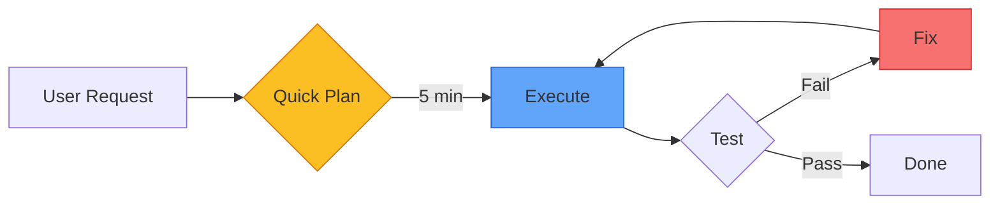
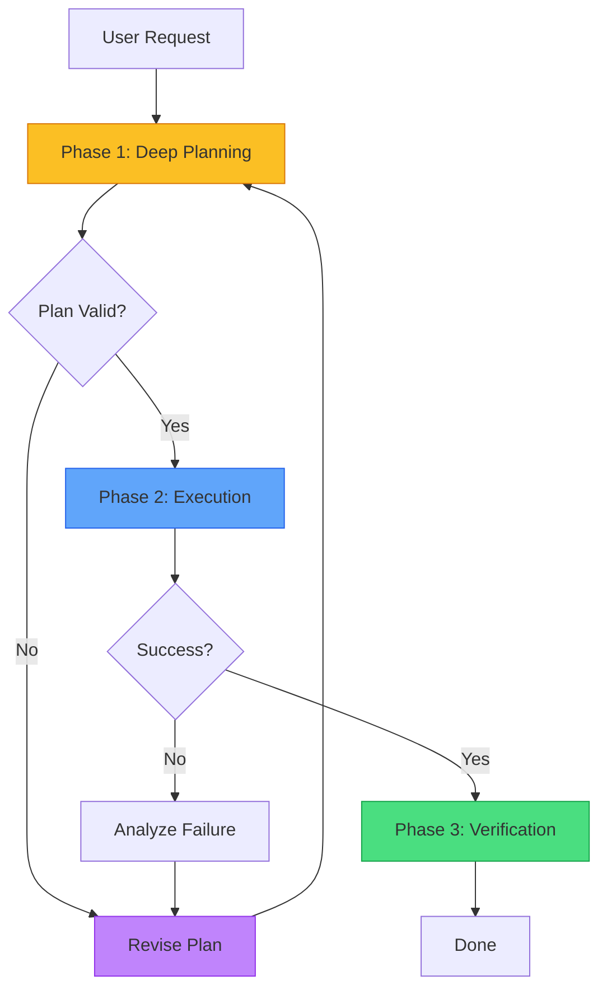

+++
title="The 85/15 Planning Ratio"
date=2026-09-11

[taxonomies]
categories = ["Engineering", "Architecture", "AI Agents"]
tags = ["Terraphim", "planning", "agent-workflow", "execution", "production"]
[extra]
toc = true
comments = true
+++


*Why most agents plan too little, execute too much, and fail too often*

In December 2024, an autonomous coding agent was tasked with implementing OAuth 2.0 authentication for a web application. It started coding immediately. It wrote 2,000 lines across 15 files. It generated client secrets, configured redirect URIs, and integrated with Google and GitHub providers.

Then it tried to run the tests. They failed. The agent had implemented OAuth 2.0 Authorization Code flow but the application needed Client Credentials flow. It had generated random client secrets instead of using the existing secret management system. It had hardcoded redirect URIs that didn't match the deployment configuration.

The agent spent the next three hours rewriting code, fixing tests, and reverting changes. Total time: 4 hours. Total progress: zero.

The agent planned for 15 minutes and executed for 3 hours and 45 minutes. The ratio was inverted. And the result was predictable.

This article argues that production agent systems should spend 85% of their compute budget on planning and 15% on execution. Most current systems invert this ratio. The result is expensive, error-prone, and slow.

---

## The Current State: 15/85

Most agent frameworks today follow this pattern:



The agent generates a plan in one turn, then enters an execute-fix loop. The plan is often:
- Incomplete (misses edge cases)
- Incorrect (wrong approach)
- Unvalidated (not checked against constraints)
- Unmeasured (no cost estimate)

The execution phase then becomes a process of discovering what the plan got wrong. Each discovery triggers a new plan, a new execution, and new failures. The agent thrashes.

### The Costs of Thrashing

| Cost Type | 15/85 Ratio | 85/15 Ratio |
|-----------|-------------|-------------|
| API calls | 50+ | 5-10 |
| Context window size | Grows unbounded | Stable |
| Error rate | 60-80% | 10-20% |
| Human intervention | Frequent | Rare |
| Wall-clock time | 3-5× optimal | Near-optimal |

The 15/85 ratio is not just inefficient. It is the primary failure mode of autonomous agents in production.

---

## The Debate: Is More Planning Just Waste?

**The "Move Fast" Argument:**

> "Agents should act quickly and iterate. Planning is overhead. The best way to find the right solution is to try multiple approaches and see what works."

This argument works for exploration tasks (research, brainstorming, creative writing) and fails for engineering tasks (code changes, infrastructure modifications, database migrations). The difference is reversibility:

| Task Type | Reversible? | Planning Required |
|-----------|-------------|-------------------|
| Write a blog post | Yes | Low |
| Refactor a function | Mostly | Medium |
| Change a database schema | No | High |
| Deploy to production | No | Very high |
| Delete user data | No | Critical |

For irreversible tasks, the cost of a wrong execution is not "try again." It is "recover from backup." Or "explain to the customer why their data is gone." Or "find a new job."

**The Counter-Counter-Argument:**

> "But planning takes time. The user is waiting. The CEO wants results."

This is a scheduling problem masquerading as an architecture problem. If the CEO wants results, deliver a quick plan first ("Here's what I'm going to do, estimated time: 2 hours"), then execute. The plan is a deliverable. It demonstrates progress. It allows course correction before expensive execution.

The alternative — execute first, plan never — produces faster initial velocity and slower overall delivery. It is the classic "fast wrong vs. slow right" tradeoff.

---

## The Solution: Planning as a First-Class Phase

The Terraphim approach treats planning as a distinct, measurable, validated phase:



### Phase 1: Deep Planning (85% of compute)

The planning phase is not "generate a todo list." It is a structured analysis:

**1. Requirement Analysis**
```
What is the user asking for?
What are the implicit requirements?
What are the constraints (time, budget, compatibility)?
What are the edge cases?
```

**2. Approach Evaluation**
```
What are the possible approaches?
What are the tradeoffs of each?
What is the risk level of each?
What is the estimated cost of each?
```

**3. Dependency Mapping**
```
What files need to change?
What systems are affected?
What tests need to be updated?
What documentation needs to change?
```

**4. Rollback Planning**
```
What is the rollback strategy?
What is the blast radius?
What is the recovery time?
```

**5. Validation**
```
Does the plan satisfy all requirements?
Does the plan respect all constraints?
Does the plan have a rollback path?
Does the plan fit within the budget?
```

### Reference Implementation

```rust
// From terraphim_orchestrator — planning phase
pub struct Plan {
    pub requirements: Vec<Requirement>,
    pub approaches: Vec<Approach>,
    pub selected_approach: Approach,
    pub dependencies: DependencyGraph,
    pub rollback: RollbackStrategy,
    pub validation: ValidationResult,
    pub estimated_cost: TokenBudget,
}

impl Plan {
    pub fn generate(task: &Task, context: &Context) -> Result<Self> {
        // 1. Analyze requirements
        let requirements = analyze_requirements(task, context)?;
        
        // 2. Generate approaches
        let approaches = generate_approaches(&requirements, context)?;
        
        // 3. Evaluate tradeoffs
        let evaluated = approaches.into_iter()
            .map(|a| evaluate_approach(a, context))
            .collect::<Result<Vec<_>>>()?;
        
        // 4. Select optimal
        let selected = select_optimal(evaluated)?;
        
        // 5. Map dependencies
        let dependencies = map_dependencies(&selected, context)?;
        
        // 6. Plan rollback
        let rollback = plan_rollback(&selected, &dependencies)?;
        
        // 7. Validate
        let validation = validate_plan(&selected, &requirements)?;
        
        Ok(Plan {
            requirements,
            approaches: evaluated,
            selected_approach: selected,
            dependencies,
            rollback,
            validation,
            estimated_cost: estimate_cost(&selected)?,
        })
    }
}
```

The plan is not a string. It is a structured object with typed fields, validation rules, and a cost estimate. It can be reviewed, approved, and audited.

### Phase 2: Execution (15% of compute)

Execution is the easy part. The plan tells the agent exactly what to do:

```rust
impl Plan {
    pub async fn execute(&self, executor: &Executor) -> Result<ExecutionResult> {
        let mut results = Vec::new();
        
        for step in &self.selected_approach.steps {
            match executor.execute(step).await {
                Ok(result) => results.push(result),
                Err(e) => {
                    // Execute rollback
                    self.rollback.execute().await?;
                    return Err(e);
                }
            }
        }
        
        Ok(ExecutionResult::success(results))
    }
}
```

If execution fails, the rollback strategy is activated automatically. There is no "figure out what went wrong and fix it." There is "restore to known-good state and report failure."

### Phase 3: Verification

After execution, the plan is verified:

```rust
impl Plan {
    pub fn verify(&self, result: &ExecutionResult) -> VerificationResult {
        VerificationResult {
            requirements_met: self.requirements.iter()
                .all(|r| r.is_met(result)),
            tests_pass: result.tests.iter().all(|t| t.passed),
            no_regressions: result.regressions.is_empty(),
            within_budget: result.actual_cost <= self.estimated_cost,
        }
    }
}
```

Verification is not "run the tests and hope." It is "check every requirement, check every test, check for regressions, check the budget."

---

## The Economics of Planning

Let's put numbers on the claim.

### Scenario: OAuth 2.0 Implementation

| Phase | 15/85 Approach | 85/15 Approach |
|-------|---------------|----------------|
| Planning | 15 min, $0.50 | 90 min, $3.00 |
| Execution | 180 min, $6.00 | 30 min, $1.00 |
| Fixing errors | 120 min, $4.00 | 0 min, $0 |
| Verification | 15 min, $0.50 | 15 min, $0.50 |
| **Total** | **330 min, $11.00** | **135 min, $4.50** |
| Success rate | 40% | 90% |

The 85/15 approach is:
- **2.4× faster** (135 min vs 330 min)
- **2.4× cheaper** ($4.50 vs $11.00)
- **2.25× more reliable** (90% vs 40%)

The upfront planning cost ($3.00 vs $0.50) pays for itself by preventing the expensive failure mode ($4.00 in fixes, 120 min of thrashing).

### When 15/85 Is Correct

The 85/15 ratio is not universal. It is correct for:
- Engineering tasks with side effects
- Infrastructure changes
- Database migrations
- Security-sensitive operations
- Irreversible actions

The 15/85 ratio is correct for:
- Research and exploration
- Creative writing
- Prototyping and demos
- Read-only analysis
- Reversible experiments

The key question is not "which ratio is correct?" but "what is the cost of failure?" When failure is expensive, plan more. When failure is cheap, act more.

---

## Caching and Reuse: The Compound Benefit

Planning has a compound benefit that execution does not: plans can be cached and reused.

```rust
pub struct PlanCache {
    cache: HashMap<TaskSignature, Plan>,
}

impl PlanCache {
    pub fn get_or_generate(&mut self, task: &Task) -> Result<Plan> {
        let signature = task.signature();
        
        if let Some(plan) = self.cache.get(&signature) {
            // Plan exists — verify it's still valid
            if plan.is_still_valid(task) {
                return Ok(plan.clone());
            }
        }
        
        // Generate new plan
        let plan = Plan::generate(task, &Context::current())?;
        self.cache.insert(signature, plan.clone());
        Ok(plan)
    }
}
```

A plan for "add OAuth 2.0 authentication" can be reused across multiple projects. The cache hit means zero planning cost for subsequent invocations. The compound effect: over time, the 85/15 ratio shifts toward 5/95 as the plan cache grows.

---

## Conclusion: Plan First, Execute Second

The 85/15 planning ratio is not a prescription for slowness. It is a prescription for speed through correctness.

Most agent systems fail not because the model is insufficient, but because the system plans insufficiently. A capable model with a bad plan is like a race car with a bad map: it moves fast in the wrong direction.

The Terraphim approach:
1. **Treat planning as a first-class phase** — not an afterthought
2. **Validate plans before execution** — check requirements, constraints, rollback
3. **Cache plans for reuse** — compound the benefit across sessions
4. **Measure planning quality** — track plan success rate, cost, and time
5. **Fail fast at planning time** — not at execution time

The harness, not the model, determines whether an agent thrashes or succeeds. And the most important part of the harness is the planning phase.

---

## Reference Implementation

The planning system described in this article is implemented in Terraphim:

- **terraphim_orchestrator** — Planning phase with requirement analysis and approach evaluation
- **terraphim_task_lock** — Immutable plan contracts before execution
- **terraphim_agent_supervisor** — Plan validation and verification
- **terraphim_persistence** — Plan caching and reuse

Repository: [github.com/terraphim-ai/terraphim](https://github.com/terraphim-ai/terraphim)  
Documentation: [docs.terraphim.ai](https://docs.terraphim.ai)  
License: Apache-2.0

---

*Alexander Mikhalev is CTO & Head of AI at Zestic AI, where he architects AI-native platforms with deterministic safety guarantees. He is the creator of Terraphim, an open-source privacy-first AI assistant built in Rust.*
