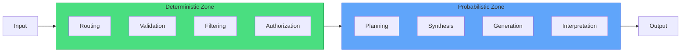

+++
title="The Deterministic Layer: Where Probabilistic Models Don't Belong"
date=2026-09-16

[taxonomies]
categories = ["Engineering", "Architecture", "AI Agents"]
tags = ["Terraphim", "determinism", "probabilistic-models", "routing", "production"]
[extra]
toc = true
comments = true
+++


*Some problems are solved. Don't use neural networks for them.*

In May 2025, an AI agent was tasked with routing user requests to the appropriate microservice. The agent used an LLM to classify requests: "Is this a user-service request, an order-service request, or a payment-service request?"

The LLM was 94% accurate on the test set. In production, it was 87% accurate. The 7% gap came from:
- Requests with ambiguous wording ("I want to check my account" — user or payment?)
- Requests with new terminology ("subscription" vs "membership")
- Requests with typos ("oder" instead of "order")
- Requests with context that changed meaning ("cancel" — cancel order or cancel subscription?)

The team added more examples to the prompt. Accuracy improved to 91%. Then a new feature launched, terminology changed, and accuracy dropped to 82%. The team was playing whack-a-mole with a probabilistic classifier.

The solution was not a better prompt. It was not a bigger model. It was a deterministic router: a set of rules that matched request patterns to services without neural inference.

Accuracy: 100%. Latency: <1ms. Cost: $0.

This article explains where deterministic code belongs in agent architecture, where probabilistic models belong, and why the boundary between them is the most important architectural decision you will make.

---

## The Boundary

Every agent system has two zones:



**Deterministic zone:** Rules, patterns, lookups, validations. Same input → same output. Always.

**Probabilistic zone:** Reasoning, creativity, synthesis, interpretation. Same input → variable output. By design.

The boundary is not about "simple vs. complex." It is about "solved vs. unsolved." If you can write a test that verifies the output, use deterministic code. If the test would need to be fuzzy, use the LLM.

---

## The Debate: But LLMs Are General-Purpose

**The "One Model to Rule Them All" Argument:**

> "LLMs are general-purpose reasoners. They can do routing, classification, validation, and generation. Why maintain two systems when one model handles everything?"

This argument is appealing and wrong. Here's why:

**1. Cost.** An LLM call costs $0.002-0.03 per 1K tokens. A deterministic router costs $0. An agent making 1,000 routing decisions per day spends $2-30 on routing alone. A deterministic router spends $0.

**2. Latency.** An LLM call takes 100-500ms. A hash lookup takes <1μs. For routing decisions that happen on every request, the latency difference is the difference between a responsive system and a sluggish one.

**3. Reliability.** An LLM is 94% accurate on routing. A deterministic router is 100% accurate. The 6% error rate compounds: 1,000 requests × 6% = 60 misrouted requests per day.

**4. Explainability.** An LLM routes a request to "user-service" because "the pattern of tokens suggests user-related intent." A deterministic router routes to "user-service" because "the path matches `/api/users/*`." One is explainable. The other is not.

**The Counter-Counter-Argument:**

> "But deterministic routers require maintenance. Every new endpoint requires a new rule. LLMs adapt automatically."

This is true and manageable. A deterministic router for a microservice architecture has ~20 rules. Adding a new service requires one new rule. The maintenance burden is not zero, but it is bounded and predictable. The cost of maintaining 20 rules is less than the cost of debugging 60 misrouted requests per day.

---

## The Deterministic Layer: What Goes Where

### Routing: Deterministic

```rust
// Deterministic request router
pub fn route(request: &Request) -> Service {
    match request.path {
        path if path.starts_with("/api/users") => Service::User,
        path if path.starts_with("/api/orders") => Service::Order,
        path if path.starts_with("/api/payments") => Service::Payment,
        _ => Service::Default,
    }
}
```

**Why deterministic:** Routing is a solved problem. HTTP paths are structured. Pattern matching is fast, reliable, and explainable.

**When to use LLM:** Never for routing. Use the LLM for understanding what the user wants, not for deciding which service handles it.

### Input Validation: Deterministic

```rust
// Deterministic input validation
pub fn validate(input: &UserInput) -> Result<(), ValidationError> {
    if input.email.is_empty() {
        return Err(ValidationError::MissingEmail);
    }
    if !EMAIL_REGEX.is_match(&input.email) {
        return Err(ValidationError::InvalidEmail);
    }
    if input.age < 18 {
        return Err(ValidationError::Underage);
    }
    Ok(())
}
```

**Why deterministic:** Validation rules are explicit. "Email must match regex" is not a probabilistic judgment.

**When to use LLM:** For fuzzy validation ("Is this text toxic?"), use the LLM. For exact validation ("Is this a valid email?"), use code.

### Context Filtering: Deterministic

```rust
// Deterministic context filtering (Aho-Corasick)
pub fn filter(documents: &[Document], role: &Role) -> Vec<Document> {
    let automata = build_automata(&role.keywords);
    
    documents.iter()
        .filter(|doc| automata.is_match(&doc.text))
        .cloned()
        .collect()
}
```

**Why deterministic:** Keyword matching is exact. "Rust" matches "Rust." It does not match "rustic" (unless the thesaurus says so).

**When to use LLM:** For semantic filtering ("Find documents about memory safety"), use the LLM. For exact filtering ("Find documents containing 'Rust'"), use automata.

### Risk Classification: Deterministic

```rust
// Deterministic risk classification
pub fn classify_risk(tool_call: &ToolCall) -> RiskTier {
    match tool_call.operation {
        Operation::Read => RiskTier::Safe,
        Operation::Write { recoverable: true } => RiskTier::Review,
        Operation::Delete | Operation::Execute => RiskTier::Critical,
    }
}
```

**Why deterministic:** Risk is a property of the operation, not the context. A `DELETE` is always critical. A `GET` is always safe.

**When to use LLM:** Never for risk classification. This is a safety-critical decision that must be deterministic.

### Authorization: Deterministic

```rust
// Deterministic authorization
pub fn authorize(user: &User, resource: &Resource, action: Action) -> Result<(), AuthError> {
    if !user.has_permission(resource, action) {
        return Err(AuthError::Forbidden);
    }
    Ok(())
}
```

**Why deterministic:** Authorization is a rule-based system. "Admin can delete" is not a probabilistic judgment.

**When to use LLM:** Never for authorization. Use RBAC, ABAC, or ReBAC.

---

## The Probabilistic Layer: What Goes Where

### Planning: Probabilistic

```
Input: "Add OAuth 2.0 authentication to the web app"
Output: Plan with steps, dependencies, and rollback strategy

Why probabilistic: Planning requires reasoning about tradeoffs,
predicting interactions, and synthesizing approaches. There is no
deterministic algorithm for "the best way to add OAuth 2.0."
```

### Natural Language Understanding: Probabilistic

```
Input: "I want to check my account but I forgot my password"
Output: Intent = ["view_account", "reset_password"]

Why probabilistic: Natural language is ambiguous. The same sentence
can have multiple intents. The LLM resolves ambiguity using context.
```

### Creative Synthesis: Probabilistic

```
Input: "Write a blog post about agent harnesses"
Output: Original article

Why probabilistic: Creativity is not deterministic. The same prompt
can produce different valid outputs.
```

### Error Recovery: Probabilistic

```
Input: "cargo test failed with 3 errors"
Output: Diagnosis and fix suggestions

Why probabilistic: Error diagnosis requires pattern matching across
many possible causes. The same error can have multiple root causes.
```

---

## The Hybrid Zone

Some tasks benefit from a hybrid approach:

### Relevance Ranking

```
Step 1 (Deterministic): Aho-Corasick filtering — O(n), exact match
Step 2 (Probabilistic): LLM reranking of top-10 results

Result: Fast deterministic recall + accurate probabilistic precision
```

### Summarization

```
Step 1 (Deterministic): Extractive summarization — key sentences
Step 2 (Probabilistic): Abstractive summarization — paraphrase

Result: Factual correctness from extractive + fluency from abstractive
```

### Code Generation

```
Step 1 (Probabilistic): LLM generates draft code
Step 2 (Deterministic): Linter validates syntax and style
Step 3 (Deterministic): Type checker validates types
Step 4 (Probabilistic): LLM fixes errors

Result: Creative generation + deterministic validation
```

---

## The Rule of Thumb

```
If you can write a test that verifies the output, use deterministic code.
If the test would need to be fuzzy, use the LLM.
```

**Deterministic test:**
```rust
#[test]
fn test_router() {
    let req = Request::new("/api/users/123");
    assert_eq!(route(&req), Service::User);
}
```

**Fuzzy test (use LLM):**
```rust
// This test is inherently fuzzy
#[test]
fn test_plan_quality() {
    let plan = generate_plan("Add OAuth 2.0");
    // How do you assert "good plan"?
    // assert!(plan.is_good())? // Not deterministic
}
```

---

## The Architecture Principle

The deterministic layer is not "old code" and the probabilistic layer is not "new AI." They are complementary.

The deterministic layer provides:
- **Speed** — <1μs for lookups, <1ms for validation
- **Reliability** — 100% accuracy for solved problems
- **Explainability** — "Because the path matched `/api/users/*`"
- **Cost** — $0 per inference

The probabilistic layer provides:
- **Flexibility** — Handles novel situations
- **Reasoning** — Synthesizes across domains
- **Creativity** — Generates original output
- **Adaptability** — Learns from examples

The art of agent architecture is knowing which layer to use for which problem. Use the deterministic layer for solved problems. Use the probabilistic layer for unsolved problems. The boundary is not fixed — it shifts as problems move from unsolved to solved.

---

## Reference Implementation

The deterministic layer described in this article is implemented in Terraphim:

- **terraphim_automata** — Aho-Corasick matching (deterministic filtering)
- **terraphim_config** — Role-based routing (deterministic dispatch)
- **terraphim_settings** — Risk classification (deterministic safety)
- **terraphim_types** — Validation schemas (deterministic input checking)

Repository: [github.com/terraphim-ai/terraphim](https://github.com/terraphim-ai/terraphim)  
Documentation: [docs.terraphim.ai](https://docs.terraphim.ai)  
License: Apache-2.0

---

*Alexander Mikhalev is CTO & Head of AI at Zestic AI, where he architects AI-native platforms with deterministic safety guarantees. He is the creator of Terraphim, an open-source privacy-first AI assistant built in Rust.*
