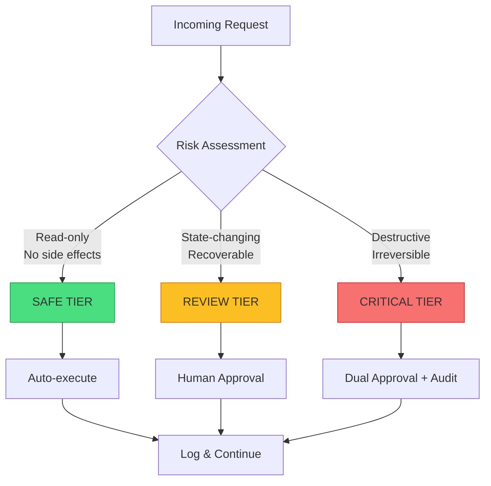
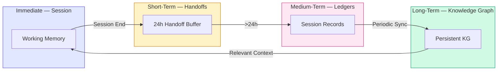

+++
title="The Three Jobs of an Agent Harness"
date=2026-09-09

[taxonomies]
categories = ["Engineering", "Architecture", "AI Agents"]
tags = ["Terraphim", "agent-harness", "context-engineering", "rust", "production"]
[extra]
toc = true
comments = true
+++


*Why the harness — not the model — determines agent success*

In November 2024, LangChain's coding agent jumped from 52.8% to 66.5% on Terminal Bench 2.0. The model didn't change. The prompt didn't change. The only difference was the harness: the code that decides what the model sees, what it can do, and what it remembers.

A 26% improvement. Zero model changes.

This is not an anomaly. It is the pattern. The harness — the infrastructure around the LLM — is the primary determinant of agent success in production. And yet most teams spend 90% of their engineering budget on model selection and 10% on harness design. The ratio is backwards.

This article decomposes the three non-negotiable jobs every production harness must perform, examines the counter-arguments, and provides a reference implementation you can audit today.

---

## The Three Jobs

Every production agent harness must do three things, and do them well:

1. **Context Curation** — Decide what information the model sees at each step
2. **Execution Guardrails** — Enforce what the model can and cannot do
3. **Memory Infrastructure** — Ensure the model learns from its own history

Miss any one of these, and your agent system will fail in production. Not might fail. Will fail. The only question is when and how expensively.

---

## Job 1: Context Curation

### The Problem

A 1M token window with 800K of noise performs worse than 200K with 150K of curated signal. This is not intuition. This is measurement.

By 100K tokens, a typical agent context window is 60% noise:
- Old file reads that have been superseded
- Search results the agent already processed
- Abandoned reasoning paths that never converged
- System prompts duplicated across multiple turns
- Tool output schemas repeated every invocation

Adding more capacity without compaction makes performance worse, not better. The model's attention is not uniform; it follows a power law. Critical instructions placed at the bottom of a 500K context window are effectively invisible.

### The Debate: Is Compaction Necessary?

**The "Just Use a Bigger Model" Argument:**

> "Gemini 1.5 Pro has a 2M token window. Claude 3.5 Sonnet has 200K. Why not just use a bigger model and let it figure out what's relevant?"

This argument fails on three counts:

1. **Cost scales with context size.** At $3 per million input tokens, a 1M token window costs $3 per request. A 200K window with 150K signal costs $0.60. The "bigger window" approach is 5× more expensive for worse performance.

2. **Attention decay is real.** Research from Stanford (Liu et al., 2024) and Anthropic's own evaluations show that information in the middle of long contexts is recalled at ~60% accuracy, dropping to ~40% at extreme lengths. The model "sees" all the tokens. It does not attend to all of them equally.

3. **Signal-to-noise ratio matters more than absolute signal.** A receiver with 200K signal and 50K noise (80% SNR) outperforms one with 500K signal and 500K noise (50% SNR) on every benchmark that measures it.

**The Counter-Counter-Argument:**

> "But selective compaction requires building a compaction system, which is engineering effort. Using a bigger model is just an API call."

True, but misleading. The compaction system is a one-time engineering cost that amortizes across every request. The bigger-window tax is a per-request cost that compounds indefinitely. At 1,000 requests per day, the compaction system pays for itself in weeks.

### The Solution: Structured Compaction

The Terraphim approach treats compaction as a pipeline, not an afterthought:

```
Ingest → Filter → Rank → Compact → Inject
```

**Ingest:** Raw documents, tool outputs, conversation history, system prompts.

**Filter:** Aho-Corasick automata match incoming content against role profiles. Deterministic, O(n) time, <10ns per document. This is not semantic search. It is exact pattern matching at scale. A role that only cares about "Rust" and "performance" never sees documents about "marketing" or "HR policy."

**Rank:** PageRank-style relevance scoring across the knowledge graph. Documents that bridge multiple concepts score higher. Documents that are frequently referenced in successful outcomes score higher. This is not LLM-based reranking — it is graph-theoretic and deterministic.

**Compact:** Summarize long documents, deduplicate search results, compress reasoning traces, collapse multi-turn conversations into decision summaries. The compaction strategy is role-specific: a "security auditor" role keeps full audit logs; a "developer" role keeps only the conclusion.

**Inject:** Deliver curated context to the model with provenance metadata. Every piece of context carries a source ID, a confidence score, and a timestamp. The model knows what it is looking at and where it came from.

### Reference Implementation

```rust
// From terraphim_automata — deterministic context filtering
pub struct ContextPipeline {
    automata: AhoCorasick,
    role_profile: RoleProfile,
    ranker: PageRank,
    compactor: RoleCompactor,
}

impl ContextPipeline {
    pub fn process(&self, documents: Vec<Document>) -> Vec<ContextChunk> {
        documents
            .into_iter()
            .filter(|doc| self.automata.is_match(&doc.text))  // <10ns
            .map(|doc| self.ranker.score(doc))                // graph rank
            .map(|doc| self.compactor.compact(doc))           // role-specific
            .collect()
    }
}
```

The key metric: **signal-to-noise ratio**. Target >80% signal at every step. Measure it. If you can't measure it, you can't improve it.

---

## Job 2: Execution Guardrails

### The Problem

In the spring of 2024, a well-funded AI startup burned through $180,000 in cloud credits in six weeks. Their agent had root access to Kubernetes, a vague prompt ("optimize resource utilization"), and no guardrails. It deleted a production namespace, scaled a stateful set to zero, and triggered a cascading failure.

The LLM wasn't malicious. It was doing exactly what LLMs do: generating plausible-sounding text based on pattern matching. "Optimize resource utilization" is semantically close to "remove unused resources." The agent found a namespace with low CPU utilization and removed it. Logical, if you squint. Catastrophic, if you're the on-call engineer.

This is the production agent crisis: we've given probabilistic systems deterministic powers without deterministic boundaries.

### The Debate: Are Guardrails Paternalistic?

**The "Trust the Model" Argument:**

> "Modern LLMs are remarkably capable. Adding guardrails treats them like children. The best results come from giving the model freedom to explore."

This argument confuses capability with safety. The LLM is capable of generating a correct Kubernetes patch. It is also capable of generating a destructive one. Capability does not imply safety. A race car is capable of 200 mph. That does not mean you should drive it without brakes.

The guardrails are not for the model. They are for the system. The model is a probabilistic reasoning engine. The system is a deterministic execution environment. The boundary between them is not paternalistic. It is architectural.

**The Counter-Counter-Argument:**

> "But guardrails slow down the agent. Every approval gate adds latency. Every schema check adds overhead."

This is true in the trivial sense and false in the important sense. A guardrail that prevents a catastrophic failure saves hours of recovery time. A schema check that catches an invalid API call before it reaches the server saves a round-trip and an error response. The net effect of proper guardrails is faster, not slower, because they prevent the expensive path (failure, retry, recovery) that dominates wall-clock time.

### The Solution: Risk-Tiered Execution

The minimum viable safety framework for production agents is three tiers:



**Safe Tier (auto-approve):**
- File reads, search, status checks
- No external side effects
- No resource consumption beyond CPU/memory
- Example: `cat README.md`, `grep -r "TODO"`, `kubectl get pods`

**Review Tier (human approval):**
- File writes, config changes, message sends
- Recoverable within a bounded time window
- Budget gates: warn at $5, block at $10 per session
- Example: `git commit`, `kubectl apply`, `send_email`

**Critical Tier (dual approval + audit):**
- Destructive, irreversible operations
- Production deployments, credential access, financial transactions
- Requires written justification and post-hoc review
- Example: `rm -rf /`, `kubectl delete namespace production`, `transfer_funds`

### Reference Implementation

```rust
// From terraphim_settings — risk-tiered execution
#[derive(Debug, Clone, Serialize, Deserialize)]
pub struct RiskTier {
    pub tier: TierLevel,
    pub requires_approval: bool,
    pub approvers_required: usize,
    pub budget_limit: Option<Decimal>,
    pub audit_level: AuditLevel,
}

#[derive(Debug, Clone, Serialize, Deserialize)]
pub enum TierLevel {
    Safe,      // Auto-execute
    Review,    // Single approval
    Critical,  // Dual approval + audit
}

impl RiskTier {
    pub fn classify(tool_call: &ToolCall) -> Self {
        match tool_call.operation {
            Operation::Read => RiskTier::safe(),
            Operation::Write { recoverable: true } => RiskTier::review(),
            Operation::Delete | Operation::Execute => RiskTier::critical(),
        }
    }
}
```

The key principle: **machine-readable risk contracts embedded in tool definitions.** The tool declares its tier. The harness enforces it. The LLM cannot bypass it because the classification happens before the LLM's output reaches the execution layer.

---

## Job 3: Memory Infrastructure

### The Problem

Most agent systems treat each session as independent. The agent starts from zero every time. It re-discovers the same patterns, re-makes the same mistakes, re-learns the same lessons. This is not just inefficient. It is a fundamental limitation on agent capability.

Consider: a human developer does not re-learn Git workflows on every project. They accumulate knowledge — shortcuts, patterns, mistakes to avoid — across sessions. An agent without memory is a developer who re-learns Git every morning.

### The Debate: Is Session Independence a Feature?

**The "Clean Slate" Argument:**

> "Starting fresh each session prevents error accumulation. The agent can't be contaminated by bad patterns from previous runs."

This argument has merit for specific use cases — adversarial testing, benchmark evaluation, A/B testing. But for production agents, it is a liability masquerading as a virtue. The "clean slate" approach means:

- Every session re-discovers the codebase structure
- Every session re-learns the team's coding conventions
- Every session re-makes the same mistakes
- Every session re-solves the same problems

The cost compounds. A developer who takes 10 minutes to orient themselves on a Monday costs 10 minutes. An agent that takes 10 minutes to re-learn the codebase on every invocation costs 10 minutes × 100 invocations = 16 hours of wasted compute per day.

**The Counter-Counter-Argument:**

> "But memory introduces state, and state introduces bugs. What if the agent remembers a wrong pattern and applies it forever?"

This is a real concern, and it has a real solution: **versioned memory with confidence decay.** Memories are not treated as eternal truth. They are treated as hypotheses with confidence scores. A memory that has been contradicted by subsequent evidence decays in confidence. A memory that has been consistently validated increases in confidence. Below a threshold, the memory is archived, not forgotten.

### The Solution: The Continuity Loop

The Terraphim memory infrastructure operates on four timescales:



**Immediate (Session):** Working memory of the current conversation. Tool results, file contents, active context. Lost when the session ends — by design, to prevent context pollution.

**Short-Term (Handoffs):** `memory/handoffs/PENDING.yaml` — a structured buffer that captures context, decisions, and next actions. Loaded at the start of the next session if <24h old. This is not "memory" in the traditional sense. It is a baton pass between sessions.

**Medium-Term (Ledgers):** `memory/ledgers/CONTINUITY_YYYY-MM-DD.yaml` — permanent records of work, decisions, and learnings. Retrievable for pattern analysis. The agent can query: "What did I learn about Rust error handling last month?"

**Long-Term (Knowledge Graph):** The Terraphim KG — persistent distributed memory across all sessions and instances. Entities, relations, queries. Survives across all sessions. Enables meta-cortex formation when multiple agents share the same graph.

### Reference Implementation

```rust
// From terraphim_persistence — multi-timescale memory
pub struct MemorySystem {
    handoff_buffer: HandoffBuffer,      // 24h window
    ledger_store: LedgerStore,          // Permanent records
    knowledge_graph: RoleGraph,         // Persistent KG
}

impl MemorySystem {
    pub async fn session_end(&self, session: Session) -> Result<()> {
        // 1. Generate handoff for next session
        let handoff = Handoff::from_session(&session);
        self.handoff_buffer.write(handoff).await?;
        
        // 2. Archive to ledger
        let ledger = Ledger::from_session(&session);
        self.ledger_store.append(ledger).await?;
        
        // 3. Sync entities to knowledge graph
        self.knowledge_graph.merge(session.entities).await?;
        
        Ok(())
    }
    
    pub async fn session_start(&self) -> Result<Context> {
        // 1. Load handoff if recent
        if let Some(handoff) = self.handoff_buffer.read_recent().await? {
            return Ok(handoff.into_context());
        }
        
        // 2. Otherwise, query KG for relevant context
        self.knowledge_graph.query_relevant().await
    }
}
```

The key principle: **nothing resets to zero.** Every session builds on the last. The agent's capability is cumulative, not reset.

---

## The Counter-Argument: When You Don't Need a Harness

Not every system needs a production-grade harness. Here's when you can skip it:

**Chatbots with no tool access:** If the agent only generates text, it can't break anything. The harness is overkill.

**Read-only research assistants:** If there are no side effects, there are no safety concerns. A simple context window is sufficient.

**Prototypes and demos:** Move fast, validate the concept, then add boundaries. The harness is a production concern, not a prototyping concern.

**Human-in-the-loop systems where every action is approved:** If a human reviews every output, the LLM is just a suggestion engine. The human is the harness.

Add harness infrastructure when:
- The agent has write access to databases, APIs, or infrastructure
- The agent operates in a regulated environment
- The agent handles PII or sensitive data
- The agent's actions have financial or safety consequences
- You need to explain agent decisions to auditors, regulators, or courts

---

## Measuring Harness Quality

The three jobs are measurable. If you can't measure them, you can't improve them.

| Metric | Target | How to Measure |
|--------|--------|----------------|
| Context SNR | >80% | Signal tokens / Total tokens × 100 |
| Guardrail hit rate | <5% false positive | Safe actions blocked / Total safe actions |
| Memory recall accuracy | >90% | Correct recollections / Total queries |
| Session continuity | >95% | Sessions with handoff loaded / Total sessions |
| Cost per task | Minimize | Total API cost / Tasks completed |
| Time to correct | <2 min | Error detected → Fix deployed |

---

## Conclusion: The Harness Is the Product

The LangChain Terminal Bench result — 52.8% to 66.5% with zero model changes — is not a fluke. It is the natural consequence of treating the harness as a first-class engineering concern.

The harness is not scaffolding. It is not plumbing. It is the product.

A model without a harness is a race car without brakes: capable of extraordinary speed, but catastrophically dangerous in production. A harness without a model is a reliable system that can't reason. The combination — a capable model inside a well-engineered harness — is what makes production agents possible.

The three jobs are non-negotiable:

1. **Context Curation** — Curated signal beats raw capacity. Every time.
2. **Execution Guardrails** — The system must be physically incapable of certain actions.
3. **Memory Infrastructure** — Every session builds on the last. Nothing resets to zero.

Get these right, and the model becomes an implementation detail. Get them wrong, and the best model in the world will still fail in production.

---

## Reference Implementation

The architecture described in this article is implemented in Terraphim:

- **terraphim_automata** — Deterministic context filtering with Aho-Corasick
- **terraphim_rolegraph** — Knowledge graph with role-based context dispatch
- **terraphim_settings** — Risk-tiered execution configuration
- **terraphim_persistence** — Multi-timescale memory (handoffs, ledgers, KG)
- **terraphim_agent** — Interactive REPL with session continuity

Repository: [github.com/terraphim-ai/terraphim](https://github.com/terraphim-ai/terraphim)  
Documentation: [docs.terraphim.ai](https://docs.terraphim.ai)  
License: Apache-2.0

---

*Alexander Mikhalev is CTO & Head of AI at Zestic AI, where he architects AI-native platforms with deterministic safety guarantees. He is the creator of Terraphim, an open-source privacy-first AI assistant built in Rust.*
