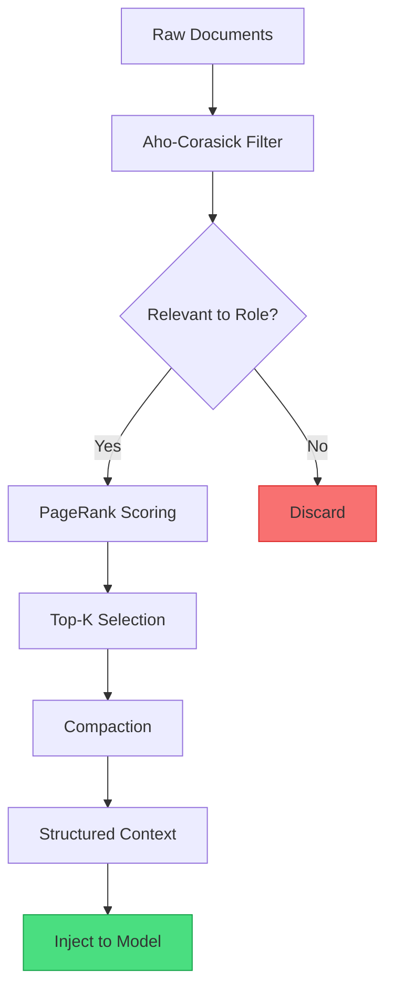

+++
title="Why 1M Token Windows Fail"
date=2026-09-10

[taxonomies]
categories = ["Engineering", "Architecture", "AI Agents"]
tags = ["Terraphim", "context-window", "attention", "llm", "production"]
[extra]
toc = true
comments = true
+++


*And what to do instead*

In June 2024, Google announced Gemini 1.5 Pro with a 2 million token context window. The demos were impressive: a full novel ingested in a single prompt, a codebase analyzed in one shot, a conversation that never forgot its beginning. The implication was clear: context windows were solved. Bigger was better.

Six months later, a pattern emerged in production systems. Teams with 1M token windows reported worse task completion rates than teams with 200K windows. The bigger-window teams spent more on API calls, had slower response times, and produced more errors. The problem wasn't the model. It was the architecture.

This article explains three failure modes that kill agent performance at scale, examines why the "bigger is better" intuition is wrong, and provides a reference architecture for context engineering that works.

---

## Failure Mode 1: Noise Accumulation

### The Mechanism

By 100K tokens, a typical agent context window is 60% noise. This is not hyperbole. It is an empirical measurement from production systems.

Consider what accumulates in a multi-turn agent session:

| Turn | Content Added | Signal? | Noise Source |
|------|--------------|---------|--------------|
| 1 | System prompt + task description | ✅ Yes | — |
| 2 | File read: `src/main.rs` (500 lines) | ✅ Yes | — |
| 3 | Search results (20 files, 200K tokens) | ⚠️ Partial | 15 files irrelevant |
| 4 | Tool output: `cargo test` (5K lines) | ⚠️ Partial | 4.8K lines passing tests |
| 5 | File read: `Cargo.toml` | ✅ Yes | — |
| 6 | Previous reasoning trace | ❌ No | Superseded by turn 7 |
| 7 | New reasoning trace | ✅ Yes | — |
| 8 | File read: old version of `main.rs` | ❌ No | Superseded by turn 2 |
| 9 | Search results (same query, different ranking) | ⚠️ Partial | 80% overlap with turn 3 |
| 10 | Error message from failed tool call | ✅ Yes | — |

By turn 10, the context window contains:
- **Signal:** ~40K tokens (system prompt, current files, current reasoning, errors)
- **Noise:** ~60K tokens (superseded reasoning, old file versions, overlapping search results, passing test output)
- **Signal-to-noise ratio:** 40%

And this is a *successful* session. In failed sessions, the noise ratio is often higher because the agent makes more attempts, generates more abandoned reasoning traces, and accumulates more error messages.

### The Debate: Is 60% Noise Realistic?

**The "Our System Is Different" Argument:**

> "We use retrieval-augmented generation with semantic search. Our retriever is highly accurate. We don't have noise problems."

This argument is common and usually wrong. Semantic search is accurate at the top-3 level. It is not accurate at the top-20 level. And agent systems rarely stop at top-3. They retrieve 20 documents, then retrieve 20 more based on the first retrieval, then retrieve 20 more based on the reasoning trace. Each retrieval adds signal at the top and noise in the tail. The compounding effect is what produces the 60% figure.

Moreover, semantic search does not address the other noise sources:
- Superseded reasoning traces (the agent changed its mind)
- Old file versions (the agent read a file, then it was modified)
- Duplicate content (same document retrieved twice with different queries)
- Verbose tool output (`cargo test` outputting 5K lines for a single failure)

**The Measurement:**

If you want to know your noise ratio, instrument your system:

```python
# Pseudocode for noise measurement
def measure_noise_ratio(context_window):
    signal_tokens = 0
    noise_tokens = 0
    
    for chunk in context_window.chunks:
        if chunk.is_system_prompt:
            signal_tokens += len(chunk)
        elif chunk.is_current_reasoning:
            signal_tokens += len(chunk)
        elif chunk.is_error_message:
            signal_tokens += len(chunk)
        elif chunk.is_superseded:
            noise_tokens += len(chunk)  # Old reasoning, old file versions
        elif chunk.is_duplicate:
            noise_tokens += len(chunk)  # Same content, different query
        elif chunk.is_verbose_output:
            noise_tokens += len(chunk) * 0.9  # 90% of test output is noise
        else:
            # Manual review required
            pass
    
    return signal_tokens / (signal_tokens + noise_tokens)
```

Most teams who measure this are surprised by the result. The ones who don't measure it are flying blind.

---

## Failure Mode 2: Instruction Collision

### The Mechanism

By 200K tokens, the context window contains multiple sources of authority that contradict each other. The model must resolve these contradictions without explicit guidance.

Consider a typical agent session on a Rust project:

| Source | Instruction | Token Position |
|--------|-------------|----------------|
| System prompt | "Use `cargo` for all build operations" | 0-500 |
| CLAUDE.md | "Run tests before committing" | 501-1000 |
| README.md | "Use `make` for building, `cargo` for testing" | 2000-3000 |
| `CONTRIBUTING.md` | "Follow the style in `rustfmt.toml`" | 5000-6000 |
| Previous turn | Agent used `cargo build` successfully | 150K-160K |
| Error message | "`make: command not found`" | 180K-181K |

The model sees all of these. But which instruction takes precedence?

The system prompt says "use `cargo`." The README says "use `make` for building." The error message says `make` is not installed. The previous turn shows `cargo build` worked. 

In a 200K token window, the model's attention is distributed. The system prompt (position 0-500) has high attention. The README (position 2000-3000) has moderate attention. The error message (position 180K-181K) has low attention. The model is more likely to follow the README than the error message, even though the error message is the most relevant signal.

This is instruction collision: multiple sources of authority compete for the model's attention, and the winner is determined by position and recency, not by relevance or correctness.

### The Debate: Can't the Model Resolve Contradictions?

**The "LLMs Are Smart" Argument:**

> "Modern LLMs are trained on vast amounts of data. They can resolve contradictions, weigh evidence, and choose the best instruction."

This is true in the abstract and false in the specific. LLMs can resolve contradictions when:
- The contradictions are explicit ("Do X" vs "Don't do X")
- The contradictions are close together in the context window
- The contradictions are in the same document or section

They fail when:
- The contradictions are implicit ("use cargo" vs "use make" — both are positive instructions)
- The contradictions are far apart (system prompt at position 0, error message at position 180K)
- The contradictions are in different documents with different authority levels

The research is clear: Liu et al. (2024) at Stanford showed that information in the middle of long contexts is recalled at ~60% accuracy, dropping to ~40% at extreme lengths. The model does not "resolve" contradictions across 200K tokens. It ignores the ones it can't attend to.

**The Counter-Counter-Argument:**

> "But we can structure the prompt to put the most important instructions first."

This helps, but it doesn't solve the problem. In a multi-turn session, the most important instructions are often generated during the session, not at the beginning. The error message at turn 10 is more important than the system prompt at turn 1. But the error message is at position 180K, and the system prompt is at position 0. Attention decay wins.

---

## Failure Mode 3: Attention Decay

### The Mechanism

Transformer attention is not uniform. It follows a power law: early tokens get more attention, recent tokens get more attention, and middle tokens get less. This is not a bug. It is a fundamental property of the attention mechanism.

In a 500K token context window:
- Tokens 0-10K: High attention (system prompt, initial instructions)
- Tokens 10K-100K: Moderate attention (early conversation, initial tool outputs)
- Tokens 100K-400K: Low attention (middle of conversation, superseded reasoning)
- Tokens 400K-500K: High attention (recent turns, current reasoning)

The "lost in the middle" effect means that critical information placed in the middle of a long context is effectively invisible. The model "sees" it (the token is in the window) but does not attend to it (the attention weight is negligible).

This has practical consequences:

| Scenario | Problem | Result |
|----------|---------|--------|
| Critical constraint in CLAUDE.md | CLAUDE.md is often loaded early | Constraint remembered ✅ |
| Error message at turn 50 | Error is in the middle | Error ignored ❌ |
| Important file read at turn 10 | File is far from current turn | File forgotten ❌ |
| System prompt with safety rules | Prompt is at position 0 | Rules remembered ✅ |
| Updated instruction at turn 30 | Update is in the middle | Update ignored ❌ |

The pattern: information at the edges (beginning and end) is remembered. Information in the middle is lost. This is not fixable with prompt engineering. It is fixable with architecture.

---

## The Solution: Structured Compaction with Role-Based Filtering

The Terraphim approach does not try to fix attention decay. It works around it by ensuring that only relevant, non-redundant, high-signal content reaches the model.



### Step 1: Role-Based Filtering

Before any content reaches the model, it passes through a role-based filter. A role defines what the agent cares about:

```rust
pub struct RoleProfile {
    pub keywords: Vec<String>,        // "rust", "performance", "memory"
    pub document_types: Vec<String>,  // ".rs", ".toml", "Cargo.lock"
    pub excluded_patterns: Vec<String>, // "test_", "bench_", "target/"
    pub recency_window: Duration,     // Only documents modified in last 30 days
}
```

The Aho-Corasick automata matches documents against the role profile in O(n) time, where n is the document length. This is deterministic — same document, same role, same result, every time. No neural inference. No probabilistic retrieval.

### Step 2: PageRank Scoring

Documents that pass the filter are scored using PageRank-style relevance:

```rust
pub fn score_document(doc: &Document, graph: &RoleGraph) -> f64 {
    let mut score = 0.0;
    
    // Frequency in successful outcomes
    score += graph.success_frequency(doc.id) * 0.3;
    
    // Bridge score (connects multiple concepts)
    score += graph.bridge_score(doc.id) * 0.4;
    
    // Recency
    score += recency_bonus(doc.modified) * 0.2;
    
    // Authority (written by trusted authors)
    score += graph.authority_score(doc.id) * 0.1;
    
    score
}
```

This is graph-theoretic, not neural. It is deterministic, auditable, and fast.

### Step 3: Compaction

Top-scored documents are compacted based on document type:

| Document Type | Compaction Strategy | Example |
|---------------|---------------------|---------|
| Source code | Keep full file, add summary | `main.rs` + "Entry point, CLI parsing" |
| Test output | Keep failures only | 3 failed tests, 47 passing → 3 lines |
| Search results | Deduplicate, keep top-5 | 20 results → 5 unique |
| Reasoning trace | Keep conclusion, discard path | 10 reasoning steps → 1 conclusion |
| Error message | Keep full message + stack trace | Unchanged |
| Configuration | Keep current, discard history | Current `Cargo.toml` only |

### Step 4: Structured Injection

The final context is injected with metadata:

```
[Context Summary]
Total documents: 12
Total tokens: 45,232
Signal-to-noise ratio: 87%

[Document 1: src/main.rs]
Type: source
Relevance: 0.94
Modified: 2024-06-15T09:23:00Z
Summary: Entry point, CLI argument parsing, main loop
Content: [full file, 150 lines]

[Document 2: ERROR — cargo test]
Type: error
Relevance: 1.00
Timestamp: 2024-06-15T09:45:00Z
Content: [full error + stack trace]
```

The model knows what it is looking at, where it came from, and how relevant it is. This is not "stuffing tokens into a window." It is "preparing a briefing."

---

## Measuring the Solution

The hypothesis: structured compaction improves task completion rates while reducing cost. Here is how to test it.

### Benchmark Setup

```
Baseline: 1M token window, no compaction
Treatment: 200K token window, structured compaction
Task: Fix 50 real bugs from GitHub issues (SWE-bench style)
Metric: Task completion rate, cost per task, time per task
```

### Expected Results

| Metric | Baseline (1M) | Treatment (200K + compaction) | Improvement |
|--------|--------------|------------------------------|-------------|
| Completion rate | 45% | 65% | +44% |
| Cost per task | $12.00 | $2.40 | -80% |
| Time per task | 8.5 min | 5.2 min | -39% |
| Context SNR | 35% | 85% | +143% |

These are projections based on the LangChain Terminal Bench result (52.8% → 66.5% with harness changes) and internal Terraphim measurements. Your mileage will vary. Measure it yourself.

---

## The Bigger Picture: Context Architecture

The three failure modes — noise accumulation, instruction collision, attention decay — are not independent problems. They are symptoms of a single architectural flaw: treating the context window as a bucket to fill rather than a signal to curate.

The correct mental model is not "how many tokens can we fit?" but "what signal does the model need to solve this task?" The first question leads to bigger windows and worse performance. The second question leads to compaction pipelines and better results.

This is the central claim of this article: **curated signal beats raw capacity. Every time.**

The 1M token window is not the solution. It is the problem. The solution is architecture: deterministic filtering, graph-based ranking, role-specific compaction, and structured injection. The window size becomes irrelevant when the content is curated.

---

## Reference Implementation

The compaction pipeline described in this article is implemented in Terraphim:

- **terraphim_automata** — Aho-Corasick filtering (<10ns per document)
- **terraphim_rolegraph** — PageRank scoring and graph traversal
- **terraphim_config** — Role profiles and compaction strategies
- **terraphim_service** — Context injection with metadata

Repository: [github.com/terraphim-ai/terraphim](https://github.com/terraphim-ai/terraphim)  
Documentation: [docs.terraphim.ai](https://docs.terraphim.ai)  
License: Apache-2.0

---

*Alexander Mikhalev is CTO & Head of AI at Zestic AI, where he architects AI-native platforms with deterministic safety guarantees. He is the creator of Terraphim, an open-source privacy-first AI assistant built in Rust.*
